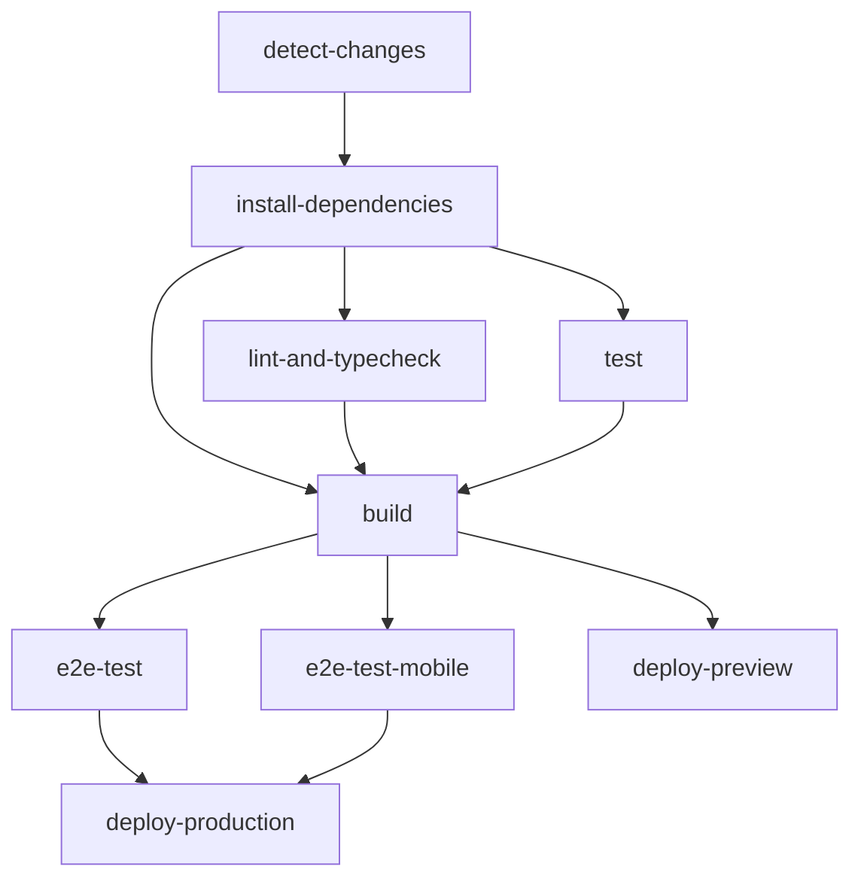

# CI/CD E2E Testing with Playwright

## Overview

The GitHub Actions workflow now includes comprehensive E2E testing using Playwright for the Restaurant Platform's micro-frontend architecture.

## Workflow Structure

### Jobs Execution Flow



## E2E Testing Jobs

### 1. `e2e-test` - Desktop Browser Testing

**Matrix Strategy**: Runs in parallel across browsers
- `chromium` (Chrome)
- `firefox` (Firefox) 
- `webkit` (Safari)

**Steps**:
1. **Setup Environment**
   - Node.js 18.x + pnpm 8
   - Install dependencies with caching
   - Install specific Playwright browser

2. **Prepare Artifacts**
   - Download build artifacts from build job
   - Setup dist directories for each MFE

3. **Run E2E Tests**
   - Execute Playwright tests for specific browser
   - Upload reports on failure

### 2. `e2e-test-mobile` - Mobile Testing

**Target Devices**:
- Mobile Chrome (Pixel 5)
- Mobile Safari (iPhone 12)

**Runs**: Only on main branch pushes

## Test Configuration

### Playwright Config Features

#### **CI vs Development**
```typescript
// CI Environment
webServer: [
  { command: 'pnpm --filter @restaurant/shell-app preview', port: 3000 },
  { command: 'pnpm --filter @restaurant/menu-mfe preview', port: 3001 },
  // ... all MFEs
]

// Development Environment  
webServer: [
  { command: 'pnpm dev:shell', url: 'http://localhost:3000' },
  { command: 'pnpm dev:menu', url: 'http://localhost:3001' },
  // ... all MFEs
]
```

#### **Browser Matrix**
- **Desktop**: Chrome, Firefox, Safari
- **Mobile**: Mobile Chrome, Mobile Safari
- **Parallel Execution**: Optimized for CI performance

#### **Retry Strategy**
- **CI**: 2 retries on failure
- **Local**: No retries for faster feedback

## Test Execution

### Available Commands

```bash
# Standard E2E testing
pnpm test:e2e                 # All browsers
pnpm test:e2e:ui              # Interactive mode
pnpm test:e2e:headed          # See browser
pnpm test:e2e:debug           # Debug mode

# CI-specific
pnpm test:e2e:ci              # CI reporter
pnpm test:e2e:report          # View HTML report

# Specific browser
pnpm test:e2e --project=chromium
pnpm test:e2e --project="Mobile Chrome"
```

### Workflow Triggers

#### **Full E2E Testing**
- **Push to main**: All browsers + mobile
- **PR to main**: All browsers only

#### **Quick Testing**  
- **Feature branches**: Unit tests only
- **Draft PRs**: Linting and type checking only

## Test Coverage

### Test Suites Included

1. **Shell App Tests** (`shell-app.spec.ts`)
   - Authentication flow
   - Navigation between MFEs
   - Role-based access control

2. **Cross-MFE Communication** (`cross-mfe-communication.spec.ts`)
   - Event bus testing
   - Real-time updates
   - Data consistency

3. **Restaurant Workflows** (`restaurant-workflows.spec.ts`)
   - Order lifecycle
   - Reservation workflow
   - Inventory management
   - Kitchen operations

4. **Performance Tests** (`performance.spec.ts`)
   - Load time verification
   - Memory usage monitoring
   - Concurrent user simulation

### Success Criteria

- **Load Times**: <3s shell app, <2s per MFE
- **Event Processing**: <10ms average
- **Memory Usage**: <50% increase after navigation cycles
- **Browser Coverage**: Chrome, Firefox, Safari, Mobile

## Artifact Collection

### On Test Failure

**Desktop Tests** (per browser):
- `playwright-report-{browser}/` - HTML test report
- `playwright-test-results-{browser}/` - Screenshots, traces

**Mobile Tests**:
- `playwright-report-mobile/` - Mobile-specific reports
- `playwright-test-results-mobile/` - Mobile artifacts

### Artifact Retention
- **Test Reports**: 30 days
- **Build Artifacts**: 7 days

## Performance Monitoring

### Core Web Vitals Tracking
- **First Contentful Paint (FCP)**
- **Largest Contentful Paint (LCP)**  
- **Cumulative Layout Shift (CLS)**

### Custom Metrics
- MFE load times
- Cross-MFE communication latency
- Memory usage patterns
- Error rates

## Debugging Failed Tests

### 1. Access Reports
```bash
# Download artifact from GitHub Actions
# Extract and open HTML report
npx playwright show-report ./downloaded-report
```

### 2. Local Reproduction
```bash
# Run same test locally
pnpm test:e2e:headed tests/e2e/failing-test.spec.ts

# Debug interactively
pnpm test:e2e:debug tests/e2e/failing-test.spec.ts
```

### 3. Trace Analysis
```bash
# View trace file from CI artifacts
npx playwright show-trace trace.zip
```

## Environment Variables

### CI-Specific Settings
- `CI=true` - Enables CI optimizations
- **Browser Installation**: Automatic via workflow
- **Reporting**: GitHub Actions format
- **Parallelization**: Optimized for CI runners

### Local Development
- **Server Reuse**: Faster test startup
- **Interactive Reports**: Automatic browser opening
- **Debug Mode**: Step-through capabilities

## Integration with Deployment

### Deployment Gates
- **Production**: Requires all E2E tests passing
- **Preview**: Runs after build completion
- **Rollback**: Failed E2E tests prevent deployment

### Performance Budgets
- Tests enforce performance budgets
- Failed performance tests block deployment
- Metrics tracked over time

## Troubleshooting

### Common Issues

1. **Port Conflicts**
   ```bash
   # Check if MFE ports (3000-3005) are available
   lsof -i :3000-3005
   ```

2. **Build Artifacts Missing**
   - Ensure build job completed successfully
   - Check artifact download step in workflow

3. **Browser Installation Failed**
   ```bash
   # Manually install browsers
   pnpm exec playwright install --with-deps
   ```

4. **Test Timeouts**
   - Increase timeout in `playwright.config.ts`
   - Check server startup logs

### Debug Commands
```bash
# Verbose test output
pnpm test:e2e --debug

# Specific test file
pnpm test:e2e tests/e2e/shell-app.spec.ts

# Check Playwright version
pnpm exec playwright --version
```

## Future Enhancements

### Planned Improvements
- **Visual Regression Testing**: Screenshot comparisons
- **API Mocking**: Isolated frontend testing
- **Load Testing**: Higher concurrent user simulation
- **Accessibility Testing**: WCAG compliance verification

### Monitoring Integration
- **Metrics Dashboard**: Real-time test results
- **Alert System**: Failed test notifications
- **Trend Analysis**: Performance regression detection