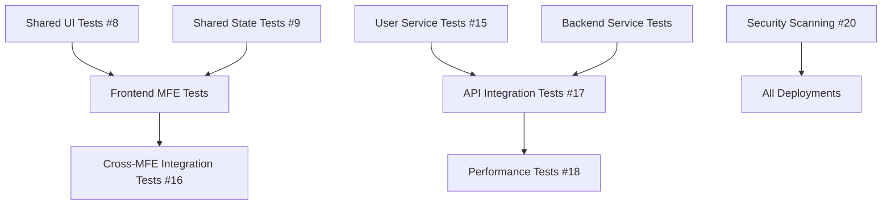

# Restaurant Platform - Project Organization

## GitHub Project Board Setup

### Recommended Columns

1. **📋 Backlog**
   - All new issues start here
   - Prioritized from top to bottom

2. **🎯 Ready to Start**
   - Issues that are ready to be worked on
   - All dependencies resolved
   - Clear acceptance criteria

3. **🚧 In Progress**
   - Currently being worked on
   - Should have an assignee
   - Maximum 2-3 items per developer

4. **🔍 In Review**
   - Code complete, PR submitted
   - Awaiting code review

5. **✅ Done**
   - Merged and deployed
   - All tests passing

### Issue Organization by Sprint

#### Sprint 1: Foundation Testing (High Priority)
**Goal**: Establish testing foundation for critical components

- [ ] #2 - Unit Tests: Shell App MFE
- [ ] #8 - Unit Tests: Shared UI Package
- [ ] #9 - Unit Tests: Shared State Package
- [ ] #15 - Unit Tests: User Service (Backend)
- [ ] #20 - Security: Implement Security Scanning

#### Sprint 2: Frontend Testing
**Goal**: Complete frontend test coverage

- [ ] #3 - Unit Tests: Menu MFE
- [ ] #4 - Unit Tests: Orders MFE
- [ ] #5 - Unit Tests: Kitchen MFE
- [ ] #6 - Unit Tests: Inventory MFE
- [ ] #7 - Unit Tests: Reservations MFE

#### Sprint 3: Backend Testing
**Goal**: Complete backend test coverage

- [ ] #10 - Unit Tests: Menu Service
- [ ] #11 - Unit Tests: Order Service
- [ ] #12 - Unit Tests: Kitchen Service
- [ ] #13 - Unit Tests: Reservation Service
- [ ] #14 - Unit Tests: Inventory Service

#### Sprint 4: Integration & Infrastructure
**Goal**: End-to-end testing and infrastructure setup

- [ ] #16 - Integration Tests: Cross-MFE Communication
- [ ] #17 - API Integration Tests: Backend Services
- [ ] #18 - Performance Tests: Load Testing Suite
- [ ] #19 - Documentation: API Documentation
- [ ] #21 - Monitoring: Implement Observability Stack

### Issue Dependencies

### Priority Matrix

| Priority | Frontend | Backend | DevOps |
|----------|----------|---------|---------|
| **High** | Shell App (#2) Shared UI (#8) Shared State (#9) | User Service (#15) All service unit tests | Security (#20) |
| **Medium** | All MFE unit tests | Integration tests (#17) | Monitoring (#21) Performance (#18) Docs (#19) |
| **Low** | - | - | - |

### Assignee Recommendations

1. **Frontend Team**
   - Lead: Shell App, Shared packages
   - Dev 1: Menu & Orders MFEs
   - Dev 2: Kitchen & Inventory MFEs
   - Dev 3: Reservations MFE

2. **Backend Team**
   - Lead: User Service, Architecture
   - Dev 1: Menu & Order Services
   - Dev 2: Kitchen & Reservation Services
   - Dev 3: Inventory Service

3. **DevOps Team**
   - Security scanning setup
   - Monitoring implementation
   - CI/CD improvements

### Definition of Done

- [ ] Code complete with unit tests
- [ ] Test coverage ≥ 80% (90% for shared packages)
- [ ] Code review approved
- [ ] Documentation updated
- [ ] CI/CD pipeline passing
- [ ] No security vulnerabilities
- [ ] Performance benchmarks met

### Tracking Metrics

1. **Velocity Metrics**
   - Issues completed per sprint
   - Test coverage percentage
   - Build success rate

2. **Quality Metrics**
   - Bug discovery rate
   - Code review turnaround time
   - Test execution time

3. **Progress Indicators**
   - Burndown chart
   - Coverage trend
   - Open vs Closed issues

### Automation Rules

1. When PR is created → Move issue to "In Review"
2. When PR is merged → Move issue to "Done"
3. When issue is assigned → Move to "In Progress"
4. Stale issues (>7 days no activity) → Add "needs-attention" label

### Weekly Standup Topics

- Blocked issues
- Testing progress by component
- Coverage metrics review
- Security scan results
- Performance baseline updates